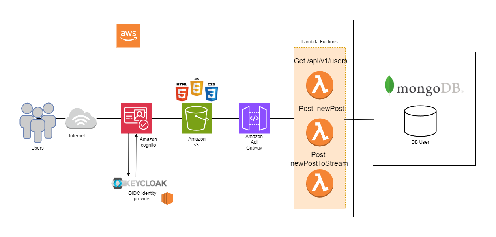

# Twittereci🚀
En este taller se desarrolló un prototipo inspirado en Twitter, inicialmente implementado con **Quarkus** como una solución monolítica. Posteriormente, se migró a una arquitectura de **microservicios** utilizando **AWS**, logrando una separación modular de funcionalidades clave:

## Arquitectura
- **Microservicios con Lambda**: Gestión de usuarios, posts y streams, desplegados como funciones independientes.
- **Autenticación segura**: Implementada con **Amazon Cognito** y **Keycloak** como proveedor OIDC.
- **Frontend estático**: Hospedado en **Amazon S3** para una entrega escalable.
- **API Gateway**: Como punto central para exponer y gestionar los endpoints.
- **Persistencia**: Datos almacenados en **MongoDB**, ideal para manejar información flexible y escalable.
  

  [VIDEO despliegue en AWS funcionando](https://drive.google.com/file/d/1TTNdBuQrmtI4xVxXxtvXiOIxMkesBUHz/view?usp=sharing)

### Instalación

1. Tener instalado Git en tu máquina local
2. Elegir una carpeta en donde guardes tu proyecto
3. abrir la terminal de GIT --> mediante el click derecho seleccionas Git bash here
4. Clona el repositorio en tu máquina local:
   ```bash
   git clone https://github.com/ChristianDuarteR/MicroServicesTwitterECI.git
   ```
## Empezando


If you want to learn more about Quarkus, please visit its website: <https://quarkus.io/>.

## Running the application in dev mode

You can run your application in dev mode that enables live coding using:

```shell script
./mvnw compile quarkus:dev
```

> **_NOTE:_**  Quarkus now ships with a Dev UI, which is available in dev mode only at <http://localhost:8080/q/dev/>.

## Packaging and running the application/ Deployment

The application can be packaged using:

```shell script
./mvnw package
```

It produces the `quarkus-run.jar` file in the `target/quarkus-app/` directory.
Be aware that it’s not an _über-jar_ as the dependencies are copied into the `target/quarkus-app/lib/` directory.

The application is now runnable using `java -jar target/quarkus-app/quarkus-run.jar`.

If you want to build an _über-jar_, execute the following command:

```shell script
./mvnw package -Dquarkus.package.jar.type=uber-jar
```

The application, packaged as an _über-jar_, is now runnable using `java -jar target/*-runner.jar`.

## Creating a native executable

You can create a native executable using:

```shell script
./mvnw package -Dnative
```

Or, if you don't have GraalVM installed, you can run the native executable build in a container using:

```shell script
./mvnw package -Dnative -Dquarkus.native.container-build=true
```

You can then execute your native executable with: `./target/twittereci-1.0.0-SNAPSHOT-runner`

If you want to learn more about building native executables, please consult <https://quarkus.io/guides/maven-tooling>.

## Related Guides

- REST ([guide](https://quarkus.io/guides/rest)): A Jakarta REST implementation utilizing build time processing and Vert.x. This extension is not compatible with the quarkus-resteasy extension, or any of the extensions that depend on it.

## Provided Code

### REST

Easily start your REST Web Services

[Related guide section...](https://quarkus.io/guides/getting-started-reactive#reactive-jax-rs-resources)


## OpenID Connect

```shell script
docker run --name keycloak -e KEYCLOAK_ADMIN=admin -e KEYCLOAK_ADMIN_PASSWORD=admin -p 8180:8080 quay.io/keycloak/keycloak:26.0.5 start-dev
```

Our project leverages OpenID Connect and Keycloak for secure management of credentials. After setting up the project on your local machine, log in using one of the available accounts to obtain an access token for your API requests.

To get your access token, visit the following link: [Keycloak Provider](http://localhost:8080/q/dev-ui/io.quarkus.quarkus-oidc/keycloak-provider) and click on **Log into Single Page Application**. Make sure to copy the generated access token.

You can now make API requests by including the token as a **Bearer** token. If you're using Postman, here’s how to add the token in the Authorization tab:


You can also use the Swagger interface included in the project to test the API. Simply click on the Swagger UI link, which will take you to the Swagger API documentation page, where you can test all endpoints.


Make sure that Swagger has the access token saved in the **Authorize** button. You should see something like this:


If the access token is not present, copy it manually and paste it into the value field in the authorization modal.


### User Accounts

Here are the available user credentials for testing:

1. **Username:** christian@gmail.com  
   **Password:** user1

## Built With
* [Maven](https://maven.apache.org/) - Dependency Management

## Authors

* **Carolina Medina Acero** - [Medina95](https://github.com/Medina95)
* **Juan Sebastián Camargo Sánchez** -  [SebSanUwU](https://github.com/SebSanUwU)
* **Christian Javier Duarte R** -  [ChristianDuarteR]( https://github.com/ChristianDuarteR)
